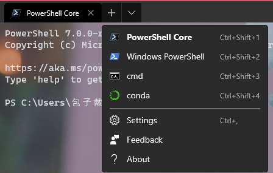

# [Windwos Terminal](https://github.com/microsoft/terminal)

## 安装

### 简单一点的方式（极度舒适）

Windows10应用商店——搜索——[安装](https://www.microsoft.com/zh-cn/p/windows-terminal-preview/9n0dx20hk701)

### 也可以稍微复杂一点——通过[Chocolatey](https://chocolatey.org/)安装（不推荐）

在正确安装Chocolatey的情况下在控制台运行

    choco install microsoft-windows-terminal

升级你的terminal

    choco upgrade microsoft-windows-terminal

## 使用

大方向就和以前的console一样使用，但是如果在安装了[pscore6](https://aka.ms/pscore6)之后，Windows Terminal 会自动集成最新的跨平台powershell，新款shell支持ls、cat等常用命令，对Linux使用者更加友好。

### 关于如何定制——以集成anaconda控制台为例



在上图中你可以看到我的terminal预设，第四项即是conda，它可以激活conda的base环境（当然，如果你需要也可以修改成你想要的任何已有环境）。在多选菜单中选择setting，当然你也可以使用快捷键 ctrl + ，接下来将使用你的默认文本编辑器打开配置文件。你需要在 profiles 下加入如下的必须部分。

```json
{
	"guid": "{e1be8991-cd60-49ea-a95f-572a945fdb7f}", 
	"hidden": false,
	"name": "conda",
	"commandline": "powershell.exe -ExecutionPolicy ByPass -NoExit -Command & D:\\Anaconda3201910\\shell\\condabin\\conda-hook.ps1 ; conda activate base",
	"icon": "D:/Anaconda3201910/Menu/anaconda-navigator.ico",
	"fontFace": "Cascadia Code",
	"backgroundImage": "ms-appdata:///Local/default.jpg",
	"backgroundImageOpacity": 0.70,
	"colorScheme": "One Half Dark" //背景较黑
}
```

其中icon、fontface、backgroundImage等外观相关属性不是必须的，重点在于 commandline。commandline支持使用分号分隔来运行多种命令。你可以根据本机的实际情况做配置。

#### 关于定制的一些tips

* [GUID生成器](https://www.guidgen.com/)

* 你可以在这份[文档](https://github.com/microsoft/terminal/blob/master/doc/cascadia/SettingsSchema.md)中看到关于配置文件更多的详情

* 你可以按住alt在点击下拉菜单的setting来查看Windows Terminal 的一份默认配置文件，不要更改它，这没有任何作用。这份配置文件是被自动继承的，所以这份配置文件中存在的颜色搭配是可以在你自定义配置文件中直接使用的，他们分别是 “Campbell”、“Campbell Powershell”、“Vintage”、“One Half Dark”、“One Half Light”、“Solarized Dark” 和 “Solarized Light”，通过继承并修改你可以快自定义出自己喜欢的配色。